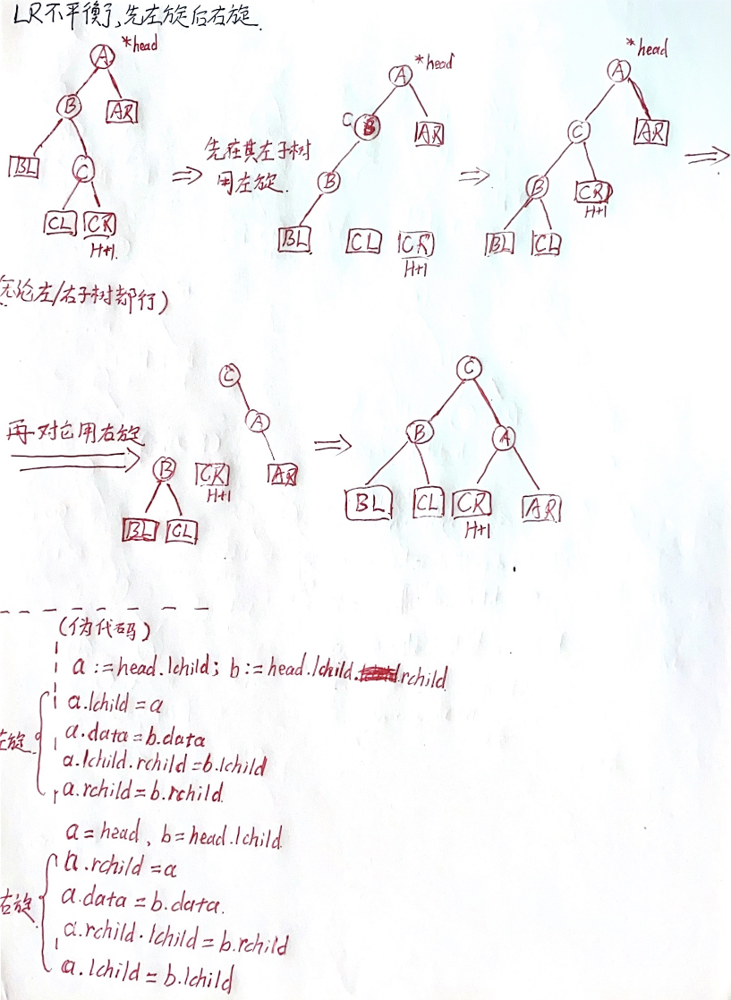

# DataStructuresAndAlgorithms
以剑指offer这本书为入门的笔记总结，同时也在这里记录相关的算法练习。
## 常用的数据结构
* [ok]**链表**
* [ok]**二叉树**
* [ok]栈
* [ok]队列
* [ok]哈希表
* 字典树
  
## 常用的算法
### 查找算法
* [ok]**二分查找**
  * [ok]插值查找（以及在选择中值上的优化）
  * [ok]指数查找
  * [ok]分块查找(类似于指数搜索，用2^i来进行分块)
* [ok]顺序查找
* [ok]二叉排序树(BST)
* 平衡二叉树(AVL)（[详情](#1)）
* *2-3查找树*
  * *红黑树(RBT)（[详情](#2)）* 
  * *B树和B+树*

### 排序算法
* 交换排序
  * [ok]冒泡排序
  * **[ok]快速排序**
* 插入排序
  * [ok]简单插入排序
  * [ok]希尔排序
* 选择排序
  * [ok]简单选择排序
  * [ok]堆排序
* 归并排序
  * **[ok]二路归并排序**
  * *多路归并排序*
* *非比较累排序*
  * *计数排序*
  * *桶排序*
  * *基数排序*

[图解排序算法](https://www.cnblogs.com/flyingdreams/p/11161157.html)
### 动态规划
### 贪心算法

## 常见的算法题

[在某github项目中找到的有关各个数据结构对应的算法题。](/leetcode.md)

## 附录
### AVL实现细节

AVL实现的基础是排序二叉树，AVL规定了任意节点的左右子树高度差的绝对值不能超过1，它还定义了节点左右子树的高度差为该节点的**平衡因子**，其值直可能为-1、0或1。所以每当在二叉排序树中插入（或删除）一个节点时，都要先见检查插入路径上的节点是否因为此次插入而导致了不平衡。若导致了不平衡，则先找到插入路径上离插入节点最近的平衡因子大于1的节点A，再对以节点A为根的子树，在保证二叉排序数的特性下，调节各节点的位置关系，使之重新达到平衡。

具体插入中，会遇到四种不平衡情况，因为在节点A的左孩子（L）的左子树（L）下插入新节点，导致了不平衡，简称：LL不平衡。其他三种不平衡情况分别为：RR不平衡、LR不平衡、RL不平衡。这四种情况的处理办法如下表：

|  不平衡情况   | 处理办法  |
|  :----:  | :----:  |
| LL不平衡  | 单右旋 |
| RR不平衡  | 单左旋 |
| LR不平衡  | 先左旋再右旋 |
| RL不平衡  | 先右旋再左旋 |

1. 具体处理LL不平衡示意图
图中A节点的左孩子的左子树插入节点导致不平衡：

2. 具体处理LR不平衡示意图
途中A节点的左孩子的右子树插入节点，导致不平衡：

剩下两种情况处理方法类似。

### RBT实现细节

[红黑树视频讲解](https://www.bilibili.com/video/BV1Tb4y197Fe?from=search&seid=15067212647568877441&spm_id_from=333.337.0.0)

RBT对平衡要求低，调整频率没有AVL高，平衡性米有AVL好；如果插入删除不怎么频繁，则AVL好点；如果相反，则BST好点。
#### **RBT特性：**

* **RBT根节点必须是黑色**
* **每个节点都有颜色，要么红色，要么黑色**
* **红黑树把空指针看作黑色节点，所以叶子节点是空节点**
* **红属性：红色节点的孩子必须为黑色节点（对黑色没有这样的要求）**
* **黑属性：任何一个节点到它的所有叶子节点的简单路径上包含的黑色节点数相同**
* RBT的最大高度为：$2\cdot\log(n+1)$,n为节点数(这里是以2为低的对数，不把空指针算入节点)
* 黑色高度：从x节点到叶子节点的路径中包含的黑色节点个数（不含叶子）

#### 插入红黑树的方式：
如果是空树，将插入的节点作为根节点并涂上黑色,如果不是空树，则插入节点总是先涂上红色并称为新节点，然后检查以下几点：
  1. 如果新节点的父节点是黑色，则插入操作结束。
  2. 如果新节点的父节点是红色，且它的兄弟节点也是红色，则将它们全部涂黑，再向上检父节点，交换它的颜色，一直往上，直到根节点结束。
  3. 如果新节点的父节点是红色，同时父节的兄弟节点是黑色或没有节点，则需要旋转，再着色。根据两个红色的位置关系判断出需要RL,LR,RR,LL的操作，最后交换颜色，使它成为红黑树。

 
#### 对红黑树的总结
排序二叉树固然查询很高效，但它有不平衡的问题，可能左子树很长右子树却很短，造成查询时性能不佳（logn退化成n），完全平衡的二叉树能保证层数平均，从而查询效率高，但是维护又很麻烦，每次插入和删除有很大的可能要大幅调整树结构。红黑树就是介于完全不平衡和完全平衡之间的一种二叉树，通过每个节点有红黑两种颜色、从节点到任意叶子节点会经过相同数量的黑色节点等一系列规则，实现了【树的层数最大也只会有两倍的差距】，这样既能提高插入和删除的效率，又能让树相对平衡从而有还不错的查询效率。从整体上讲，红黑树就是一种中庸之道的二叉树。
